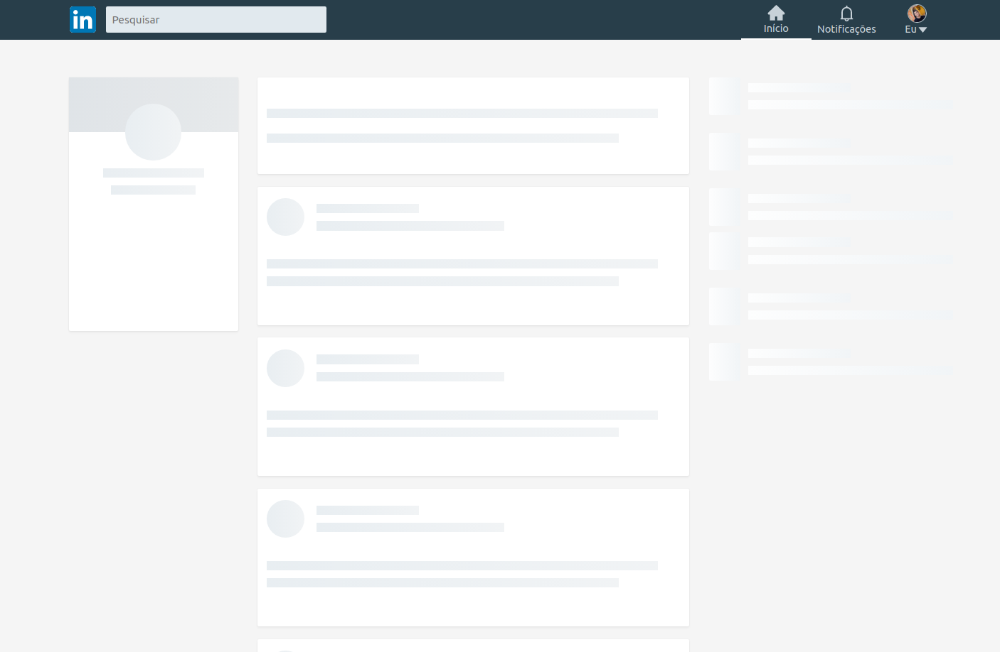

## <div align="center"></div>

###




<p align="center">💼 A clone of Linkedin's homepage with shimmer effect</p>

## 🛠️ Technologies

<ul>
  <li><a href="https://reactjs.org/">React</a></li>
  <li><a href="https://styled-components.com/">Styled Components</a></li>
  <li><a href="https://reactjs.org/">TypeScript</a></li>
</ul>

## ⚙️ Requirements

<ul>
  <li><a href="https://git-scm.com/">Git</a></li>
  <li><a href="https://nodejs.org/en/">Node.js</a></li>
  <li><a href="https://www.typescriptlang.org/">Yarn</a></li>
</ul>

## 🚀 Installation

```bash
$ git clone https://github.com/gabrielsanttana/linkedin
$ cd linkedin
$ yarn
$ yarn start
```

The application will pop-up in the browser on http://localhost:3000

## ⚖️ License

[MIT License](https://github.com/gabrielsanttana/linkedin/blob/master/LICENSE)

<h6 align="center">Made with ❤️ by <a href="https://linkedin.com/in/gabrielsanttana">Gabriel Santana</a></h6>


